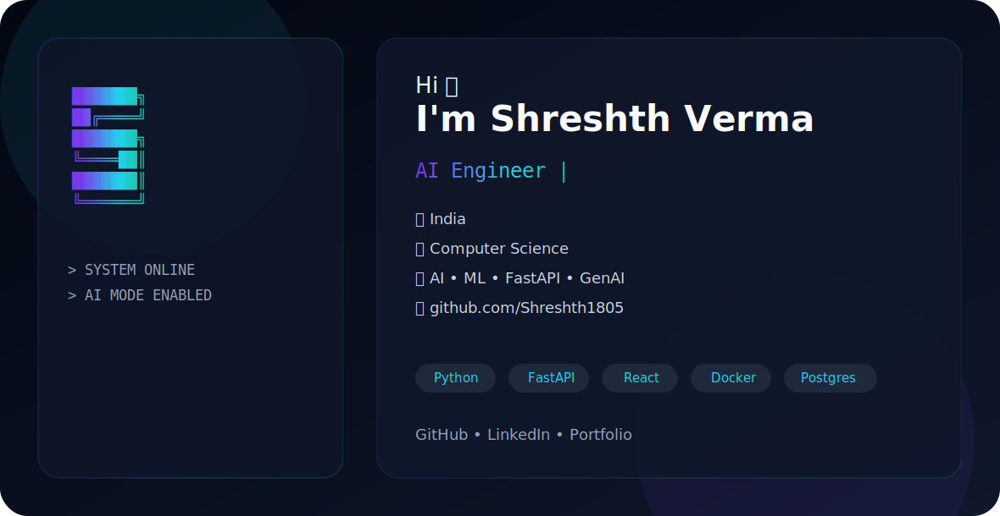

<div align="center">

<picture>
    <source media="(prefers-color-scheme: dark)" srcset="assets/dark.svg">
    <source media="(prefers-color-scheme: light)" srcset="assets/light.svg">
    
</picture>

<br>

# Hi 👋 I'm Shreshth Verma

### AI Engineer • Machine Learning Engineer • Full Stack Developer


<br>

<a href="https://github.com/Shreshth1805">

</a>

<a href="https://linkedin.com/in/YOUR_LINKEDIN">

</a>

<a href="mailto:YOUR_EMAIL">

</a>

<a href="https://YOUR_PORTFOLIO">

</a>

</div>

---

# 🚀 About Me

```yaml
Name: Shreshth Verma

Location: India 🇮🇳

Education: Computer Science

Current Focus:
  - Artificial Intelligence
  - Machine Learning
  - LLM Applications
  - AI Agents
  - MLOps

Learning:
  - LangGraph
  - Multi Agent Systems
  - Kubernetes
  - AWS

Open To:
  - Software Engineer
  - AI Engineer
  - ML Engineer
```

---

# 💻 Tech Stack

## Languages

<p>


</p>

---
### Frontend
<p>
  
</p>
---

### Backend
<p>
  
</p>
---

### Deployment & API Testing
<p>
  
  
</p>

## AI / ML

<p>


</p>

- LangChain
- Hugging Face
- OpenAI API
- GROQ
- Ollama
- Scikit-Learn
- Pandas
- NumPy

---

## Database

<p>


</p>

---

## DevOps

<p>


</p>

---

# 🔥 Featured Projects

| Project | Description |
|----------|-------------|
| 🤖 AI Software Engineer | Multi-Agent AI Platform with FastAPI |
| 🧠 ANN Churn Prediction | Deep Learning Customer Churn Model |
| 🎓 AI Tutor | Personalized AI Learning Platform |
| 💬 AI Chat Applications | OpenAI + LangChain Projects |
| 🌐 Full Stack Apps | React + Next + FastAPI |

---

# 📊 GitHub Statistics

<div align="center">


</div>

---

# 📈 Activity Graph

<div align="center">


</div>

---

# ⚡ Most Used Languages
<p>


</p>
---

# 📫 Connect With Me

<div align="center">

<a href="https://github.com/Shreshth1805">

</a>

<a href="/https://www.linkedin.com/in/shreshth-verma-4b20a1378/">

</a>

<a href="mailto:shreshthverma1805@gmail.com">

</a>

</div>

---

<div align="center">

### Thanks for visiting my profile!

> Building intelligent software for the future.


</div>
